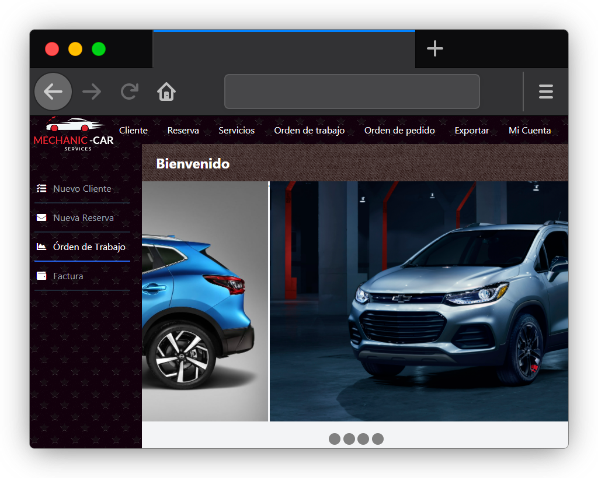

# Mechanic Car Services (M.C.S.)

## ¿Qué es esto?
Sistema de gestión y administración web del taller mecánico "ServiExpress".

## ¿Quién es el patrocinador?
- **Juan Pedro**, mecánico automotriz.

## ¿Qué necesito instalar?
- Python 3
- Django (´pip install django´)
- cx_oracle (´pip install cx_oracle´)
- Oracle 18c (cliente/servidor dependiendo de la ubicación de la base de datos).

## ¿Cómo lo echo a andar?
**Usuarios de Windows**
- **Doble click en** `up`.
- Saltará el navegador.
- Ya puedes ver el proyecto.
- Yera.

---

**Linux**

Por línea de comandos: 

- Escribir en la terminal `python3 manage.py runserver`
- Abrir el navegador en [localhost:8000](http://localhost:8000/) o [127.0.0.1:8000](http://127.0.0.1:8000/).

## ¿Qué lenguajes/bases de datos/control de versiones se utilizaron?
- **FrontEnd**: Html5, JavaScript, CSS, Tailwind
- **BackEnd**: Python 3.9.4 (Django 3.2.3) 
- **Motor de base de datos**: Oracle 18c
- **Control de versiones**: Git & GitHub.

## Librerías extras de terceros.
- Validador de rut [github.com/gevalenz/rut-chile](https://github.com/gevalenz/rut-chile)
## Agradecimientos
Se agradece infinitamente a los desarrolladores que hicieron esto posible:

- Fabian Astorga [@Ocikotorzido](https://github.com/Ocikotorzido)
- Francisco Marfull [@Marfullsen](https://github.com/Marfullsen)
- José Lorca [@JoseLorca](https://github.com/JoseLorca)