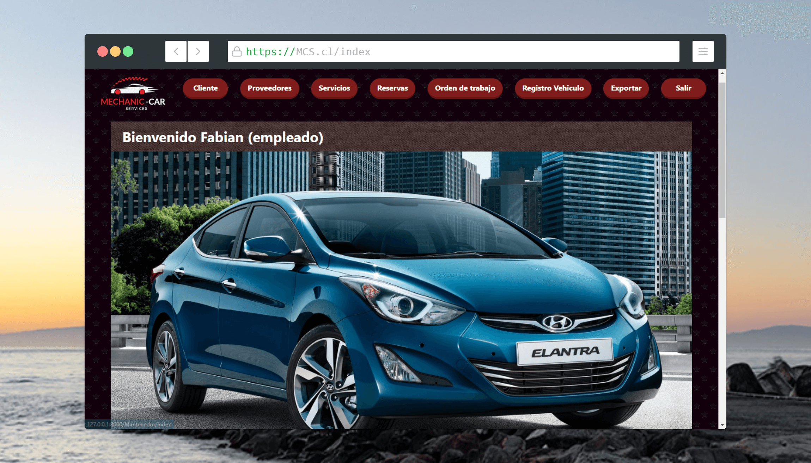
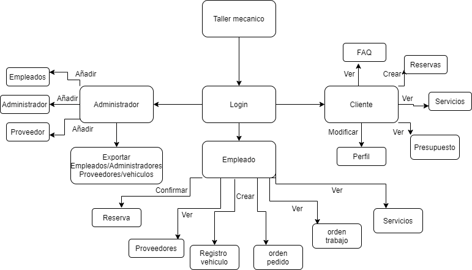
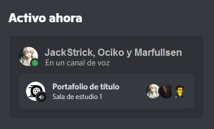

# Mechanic Car Services (M.C.S.)
[](https://www.python.org/)
[](https://www.djangoproject.com/)
[](https://www.tailwindcss.com/)
[](https://www.djangoproject.com/)

[](https://github.com/Ocikotorzido/congenial-funicular/tree/master/pantallazos/)

## ¿Qué es esto?
Sistema de gestión y administración **web** del taller mecánico "ServiExpress".

## ¿Quién es el patrocinador?
- **Juan Pedro**, mecánico automotriz.

## ¿Qué funciones tiene este sitio?
### Estructura del sitio
[](https://github.com/Ocikotorzido/congenial-funicular/tree/master/pantallazos/)

## ¿Qué necesito instalar?
### Obligatorio
- Oracle 18c (cliente/servidor dependiendo de la ubicación de la base de datos).
- LibreOffice/MS-Office 365
- Python 3
- Dependencias de externas (`pip install -r requirements.txt`)
  - **En caso de error, instalar las dependencias por separado:**
    - Django (`pip install django`)
    - cx_oracle (`pip install cx_oracle`)
    - Pandas (`pip install pandas`)
    - Docx2PDF (`pip install docx2pdf`)

---

[](https://www.djangoproject.com/)   
[](https://www.djangoproject.com/)   
[](https://pandas.pydata.org/)   
[](https://www.office.com/)   
[](https://www.libreoffice.org/)

## ¿Qué debo configurar?
### Usuario Súper-administrador
Se debiera crear un usuario administrador.

- `python manage.py createsuperuser`

### Rellenar las tablas con los datos iniciales.
El sistema trae datos predeterminados para evitar estar ingresando datos ficticios.
- `python manage.py poblate`

### Atajos para desarrolladores. (Recomendado)
El sistema trae las más diversas combinaciones de atajos de teclado, sólo se debe ejecutar el archivo `atajos.bat` y los comandos se instalarán **de manera local** (temporal) en la sesión actual de la terminal y aparecerá una lista con los comandos dispobibles.
- `atajos.bat` (en PowerShell `.\atajos.bat`)
### Archivo de configuración para envío de emails.
Crear un archivo de configuración (**settings.ini**) con la siguiente información:
```
[Settings]
EMAIL_HOST_USER = MI_CORREO_ELECTRONICO@gmail.com
EMAIL_HOST_PASSWORD = CONTRASEÑA_PARA_APLICACIÓN_CON_SEGURIDAD_DESHABILITADA
SECRET_KEY = CLAVE_SECRETA_DEL_DJANGO
NAME_DB = NOMBRE_DE_LA_BASE_DE_DATOS
USER_DB = NOMBRE_DE_USUARIO_DE_LA_BASE_DE_DATOS
PASSWORD_DB = CONTRASEÑA_DE_LA_BASE_DE_DATOS
```

Se debe tener en cuenta:

- Este archivo debe llamarse **settings.ini** y debe estar al mismo nivel de **manage.py**.

- La constante **EMAIL_HOST_USER** debe tener un correo GMAIL.

- La constante **EMAIL_HOST_PASSWORD** debe tener una clave de aplicación con verificación en dos pasos y acceso a aplicaciones 'poco seguras'.

## ¿Cómo lo echo a andar?
Si todo se instaló correctamente, es tan simple como hacer click en **up**.

**Usuarios de Windows**
- **Doble click en** `up`.
- Se abrirá el navegador.
Voilà, si todo salió bien, estarás en la página princial.

---

**Linux**

Por línea de comandos: 

- Escribir en la terminal `python3 manage.py runserver`
- Abrir el navegador en [localhost:8000](http://localhost:8000/) o [127.0.0.1:8000](http://127.0.0.1:8000/).

## ¿Qué lenguajes/bases de datos/control de versiones se utilizaron?
- **FrontEnd**: Html5, JavaScript, CSS, Tailwind
- **BackEnd**: Python 3.9.4 (Django 3.2.3) 
- **Motor de base de datos**: Oracle 18c
- **Control de versiones**: Git & GitHub.

## Librerías extras de terceros.
- Validador de rut. [github.com/gevalenz/rut-chile](https://github.com/gevalenz/rut-chile)
- docx2pdf. [github.com/AlJohri/docx2pdf](https://github.com/AlJohri/docx2pdf)

## Recursos
- screenshot.rocks, [https://screenshot.rocks/](https://screenshot.rocks/)
- Generador de ruts, [https://generarut.cl/](https://generarut.cl/)

## Capturas de pantalla.


**Inicio de sesión**

## Sobre el equipo de trabajo
Nuestro equipo de trabajo se divide en dos áreas, **desarrollo** y **diseño**.

### Sobre los desarrolladores
Nuestro equipo de desarrollo está conformado por dos estudiantes de programación:

- Fabian Astorga [@Ocikotorzido](https://github.com/Ocikotorzido)
- Francisco Marfull [@Marfullsen](https://github.com/Marfullsen)

### Sobre los logos
Ambos logos del taller, junto al logo personalizado del citt fueron hechos por nuestro diseñador.

- José Lorca [@JoseLorca](https://github.com/JoseLorca)

### Sobre la comunicación
Discord fue nuestro mejor aliado al momento de establecer la comunicación con el equipo.

[](https://github.com/Ocikotorzido/congenial-funicular/tree/master/pantallazos/)

## Agradecimientos
Agradecemos de corazón a todos los que hicieron esto posible, sin su ayuda, nos hubiera costado mucho más terminar este proyecto.

[](https://www.duoc.cl/citt/)

- Centro de Innovación y Transferencia Tecnológica (CITT). 